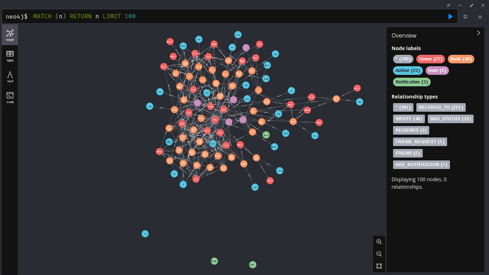
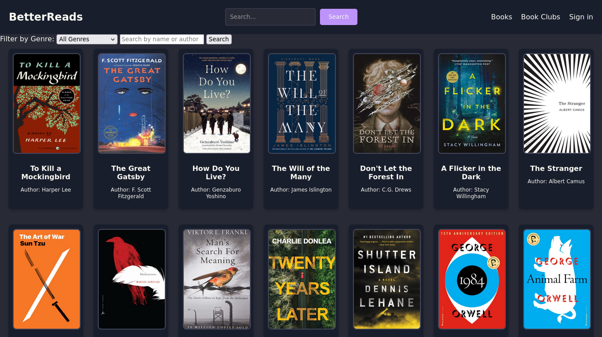
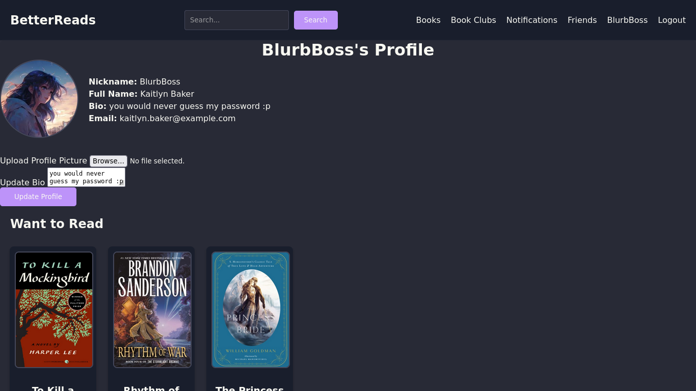
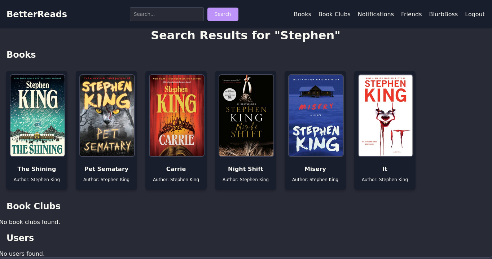
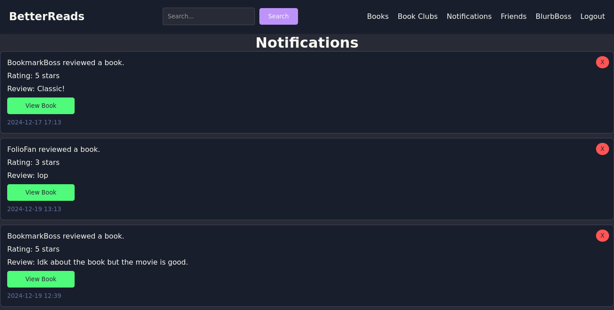
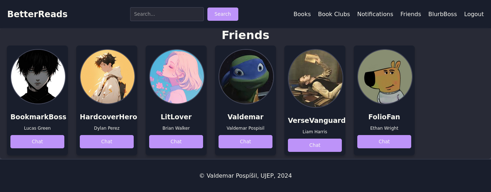

# BetterReads


BetterReads is a social network focused on books. Users can track their reading progress, add friends, join book clubs, and chat with others. The platform allows users to search and filter books and categorize them as **Want to Read**, **Reading**, or **Read**.

## Features

- 📚 Track reading progress (`Want to Read`, `Reading`, `Read`)
- 👫 Add friends and chat with them
- 📖 Join book clubs and participate in discussions
- 🔍 Search and filter books
- 🛠 Built with **Python Flask** and **Neo4j** database

## Installation

### Prerequisites

- **Docker**
- **Docker Compose**

### Running the Project

Clone the repository:

```bash
git clone https://github.com/ValdemarPospisil/BetterReads.git
cd BetterReads
```

Start the application using Docker Compose:

```bash
docker-compose up --build
```

This will pull necessary images, build the services, and start the application.

### Accessing the App

Once running, the application will be accessible at:

```
http://localhost:5000
```
### Neo4j Database Access

Neo4j database is available at:

```
http://localhost:7474
```

Login with default credentials (if not changed):

 - Username: _neo4j_

 - Password: _password_

### Graph Visualization

Below is an overview of the Neo4j database structure:



If you want to explore the graph interactively, open the Neo4j Browser at http://localhost:7474 and run queries like:

```cypher
MATCH (n)-[r]->(m) RETURN n, r, m LIMIT 50;
```


## Technologies Used

- **Backend:** Flask (Python)
- **Database:** Neo4j
- **Frontend:** HTML/CSS/JavaScript
- **Containerization:** Docker, Docker Compose

## Screenshots

### Books


### Profile


### Search query


### Notifications


### Friends


## Contributing

This is a personal portfolio project, but feel free to open an issue if you have suggestions or find any bugs.


---

For any questions or feedback, feel free to reach out!

